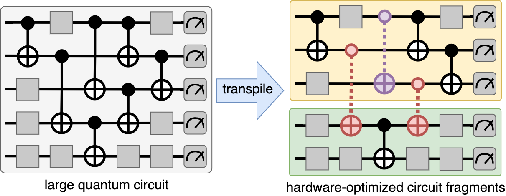

# VQC - Virtual Quantum Computing



VQC is a framework for virtual optimization of quantum cricuits. It builds on the work of 
"Constructing a virtual two-qubit gate by sampling single-qubit operations" [[1]](#1) to allow transparent use of
binary gate virtualization, both in order to mitigate noise and allow executions of large quantum circuits on small quantum devices.

This project started from a [Bachelor's thesis](https://raw.githubusercontent.com/TUM-DSE/research-work-archive/main/archive/2022/summer/docs/bsc_tornow_dqs_a_framework_for_efficient_distributed_simulation_of_large_quantum_circuits.pdf) at TU Munich.

## Installation
```shell
pip install vqc
```

## Getting Started

### Cutting a `QuantumCircuit` into a `VirtualCircuit` through gate virtualization 

```python
import vqc
from qiskit import QuantumCircuit

# create your quantum circuit with Qiskit
circuit = QuantumCircuit(4)
circuit.h(0)
circuit.cx([0, 2, 1, 0, 2], [1, 3, 2, 1, 3])
circuit.measure_all()
print(circuit)
"""
        ┌───┐                ░ ┌─┐         
   q_0: ┤ H ├──■─────────■───░─┤M├─────────
        └───┘┌─┴─┐     ┌─┴─┐ ░ └╥┘┌─┐      
   q_1: ─────┤ X ├──■──┤ X ├─░──╫─┤M├──────
             └───┘┌─┴─┐└───┘ ░  ║ └╥┘┌─┐   
   q_2: ──■───────┤ X ├──■───░──╫──╫─┤M├───
        ┌─┴─┐     └───┘┌─┴─┐ ░  ║  ║ └╥┘┌─┐
   q_3: ┤ X ├──────────┤ X ├─░──╫──╫──╫─┤M├
        └───┘          └───┘ ░  ║  ║  ║ └╥┘
"""

# create a virtual quantum circuit by cutting with bisection
# so that the virtual circuit consists of two fragments
# (virtual gates are denoted as a Barrier atm)
virt_circuit = vqc.cut(circuit, vqc.cut.Bisection())
print(virt_circuit)
"""
         ┌───┐              ░ ┌─┐         
frag0_0: ┤ H ├──■───────■───░─┤M├─────────
         └───┘┌─┴─┐ ░ ┌─┴─┐ ░ └╥┘┌─┐      
frag0_1: ─────┤ X ├─░─┤ X ├─░──╫─┤M├──────
              └───┘ ░ └───┘ ░  ║ └╥┘┌─┐   
frag1_0: ──■────────░───■───░──╫──╫─┤M├───
         ┌─┴─┐      ░ ┌─┴─┐ ░  ║  ║ └╥┘┌─┐
frag1_1: ┤ X ├────────┤ X ├─░──╫──╫──╫─┤M├
         └───┘        └───┘ ░  ║  ║  ║ └╥┘
"""
# fragments are modeled as a subclass of QuantumRegisters
print(virt_circuit.fragments)
"""
[Fragment(2, 'frag0'), Fragment(2, 'frag1')]
"""
```

### Executing the virtualization

The virtualization process (including circuit sampling/configuration and result-knitting) is independent from the actual execution. In the end, up to 6^k circuit-fragments have to be executed for k virtual gates. Each execution is completely independent from the other.

```python


```

## References

<a id="1">[1]</a> 
Mitarai, Kosuke, and Keisuke Fujii. "Constructing a virtual two-qubit gate by sampling single-qubit operations." New Journal of Physics 23.2 (2021): 023021.

