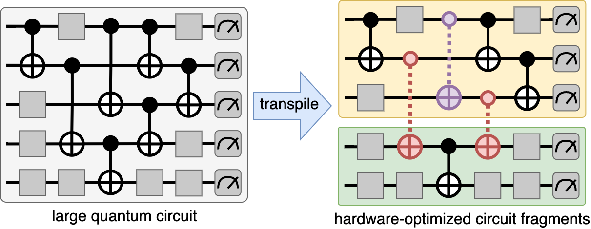

# QVM - Quantum Virtual Machine



QVM is a framework for virtual optimization and distributed execution of quantum cricuits. It builds on the work of 
"Constructing a virtual two-qubit gate by sampling single-qubit operations" [[1]](#1) to allow transparent use of
binary gate virtualization, both in order to mitigate noise and allow executions of large quantum circuits on small quantum devices.

## Installation
```shell
pip install qvm # TODO
```

## Quick Start

### Virtual Gates

Using `qvm.virtual_gate.VirtualGate` in qiskit circuits.
QVM supports the three virtual gates `VirtualCX`, `VirtualCZ` and `VirtualRZZ`.

```python
from qiskit import QuantumCircuit
from qiskit.providers.aer import AerSimulator

from qvm.circuit import DistributedCircuit
from qvm.virtual_gate import VirtualCX
from qvm.executor import execute

circuit = QuantumCircuit(2)
circuit.h(0)
# append a virtual gate to the circuit
# (virtual gates are subclasses of barriers)
circuit.append(VirtualCX(), [0, 1])
circuit.measure_all()
print(circuit)

# create a distributed circuit of the circuit with
# virtual gates. The distributed circuit has multiple fragments,
# each fragment is represented as a quantum register.
dist_circ = DistributedCircuit.from_circuit(circuit)
print(dist_circ)
print(dist_circ.fragments)

# execute the distributed circuit (both fragments are executed independently)
counts = execute(dist_circ, default_backend=AerSimulator(), shots=1000)
print(counts)
```

### Cut Transpilers


You can use transpiler passes to automatically virtualize binary gates in a given circuits.
In this example we use the `qvm.cut.Bisection` transpiler pass,
which replaces binary gates with virtual gates to distribute 
the circuit into two equally sized fragments.

```python
from qiskit import QuantumCircuit
from qiskit.providers.aer import AerSimulator
from qiskit.transpiler import PassManager

from qvm.cut import Bisection
from qvm.circuit import DistributedCircuit
from qvm.executor.executor import execute

# initialize a 4-qubit circuit
circuit = QuantumCircuit.from_qasm_file("examples/qasm/hamiltonian.qasm")

# build and run a transpiler using the bisection pass.
pass_manager = PassManager(Bisection())
cut_circ = pass_manager.run(circuit)

dist_circ = DistributedCircuit.from_circuit(cut_circ)
print(dist_circ)

result = execute(dist_circ, AerSimulator(), 1000)
print(result)
```


## References

<a id="1">[1]</a> 
Mitarai, Kosuke, and Keisuke Fujii. "Constructing a virtual two-qubit gate by sampling single-qubit operations." New Journal of Physics 23.2 (2021): 023021.

