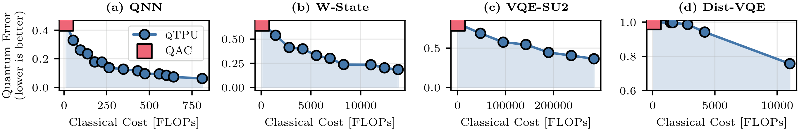
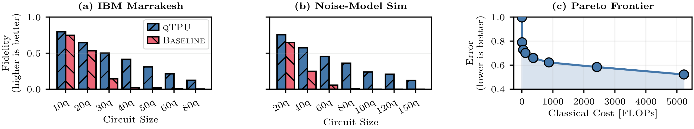
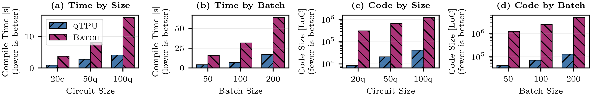
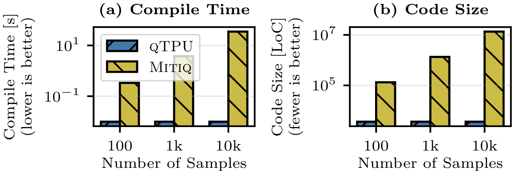

<div align="center">

# qTPU: Hybrid Tensor Networks for Quantum-Classical Acceleration

<!-- [](https://arxiv.org/abs/2410.15080)  -->
[](https://github.com/nathanieltornow/qtpu)

</div>

<div align="center">
  <p>
    <a href="#overview">Overview</a> &ensp;|&ensp;
    <a href="#main-results">Results</a> &ensp;|&ensp;
    <a href="#getting-started-instructions">Getting Started</a> &ensp;|&ensp;
    <a href="#detailed-instructions-reproducing-paper-results">Reproducing Results</a>
    <!-- &ensp;|&ensp; -->
    <!-- <a href="#citation">Citation</a> -->
  </p>
</div>

---

## Overview

qTPU is an end-to-end system for unified hybrid quantum-classical computing. It introduces the **hybrid tensor network (hTN)** abstraction — a programming model, compiler, and runtime that bridge quantum and classical accelerators under a single representation.

## Main Results

<div align="center">
  
  <br/>
  <em>Compiler tradeoff (Fig. 9): qTPU exposes a flexible Pareto frontier; QAC produces a single fixed solution.</em>
</div>

<br/>

<div align="center">
  
  <br/>
  <em>Hardware validation (Fig. 11): (a) IBM Marrakesh, (b) noise-model sim to 150q, (c) Pareto frontier at 80q.</em>
</div>

<br/>

<div align="center">
  
  <br/>
  <em>Hybrid ML (Fig. 14): compilation time and code size — batch execution vs. qTPU.</em>
</div>

<br/>

<div align="center">
  
  <br/>
  <em>Error mitigation (Fig. 15): qTPU is 3,500x faster and generates 3,700x less code than Mitiq.</em>
</div>

---

## Getting Started Instructions

These instructions will get you from zero to running a qTPU example in under 30 minutes.

### Prerequisites

- Python 3.11–3.13
- [uv](https://docs.astral.sh/uv/) (recommended) or pip

### Installation

```bash
git clone https://github.com/nathanieltornow/qtpu.git && cd qtpu
uv sync
```

<details>
<summary>Alternative: pip install</summary>

```bash
pip install git+https://github.com/nathanieltornow/qtpu.git
```

</details>

<details>
<summary>Docker (GPU-enabled)</summary>

```bash
docker build -t qtpu .
docker run --gpus all -it qtpu
```

</details>

### Hello World

```python
import qtpu
from qiskit.circuit.random import random_circuit

# Build a 20-qubit circuit
qc = random_circuit(20, depth=5, seed=42)

# Compile: partition into <=18-qubit subcircuits
htn = qtpu.compile_to_heinsum(qc, max_size=18)

print(f"Quantum tensors:  {len(htn.quantum_tensors)}")
print(f"Classical tensors: {len(htn.classical_tensors)}")
```

See [`examples/`](./examples/) for circuit cutting, Pareto frontier exploration, and hybrid ML.

### Verify Plots Generate

```bash
uv run python -m evaluation.compiler.plot
# Expected: saves PDF to plots/plot_pareto_frontiers/...
```

---

## Detailed Instructions: Reproducing Paper Results

All figures from the paper can be reproduced from the pre-collected logs in `logs/`. See **[REPRODUCE.md](./REPRODUCE.md)** for the full step-by-step walkthrough covering every figure, table, and benchmark.

**Quick start** — generate any figure in seconds:

```bash
uv run python -m evaluation.compiler.plot          # Fig. 9, 10, Table 1
uv run python -m evaluation.hardware.plot_qnn      # Fig. 11 (hardware + noise sim)
uv run python -m evaluation.runtime.plot            # Fig. 12
uv run python -m evaluation.use_cases.scale.plot    # Fig. 13
uv run python -m evaluation.use_cases.hybrid_ml.plot          # Fig. 14
uv run python -m evaluation.use_cases.error_mitigation.plot   # Fig. 15
uv run python -m evaluation.use_cases.end_to_end.plot         # Fig. 16
```

### Artifact Claims

- **All figures and tables** (Fig. 9–16, Table 1) can be reproduced from the included logs in `logs/` without any special hardware. Each plot command runs in seconds.
- **All benchmarks except IBM hardware** can be re-run from scratch using the `run.py` scripts in `evaluation/` (see [REPRODUCE.md](./REPRODUCE.md)). Expect minutes to hours depending on the benchmark.
- **Fig. 11a (IBM Marrakesh)** requires access to IBM Quantum hardware and cannot be reproduced without IBM credentials (`IBM_TOKEN` + `IBM_CRN`). The pre-collected hardware logs are included.
- **Fig. 11b–c (noise-model simulations)** can be re-run locally without hardware access.

### Repository Structure

```
src/qtpu/              Core library (compiler, runtime, transforms)
evaluation/            Benchmark scripts (run + plot per section)
  compiler/            Section 8.4 — Compiler tradeoff and scalability
  runtime/             Section 8.5 — Runtime analysis and multi-QPU scaling
  hardware/            Section 8.4 — Hardware validation (IBM Marrakesh)
  use_cases/
    scale/             Section 8.7 — Scalable hybrid computing vs QAC
    hybrid_ml/         Section 8.6 — Hybrid ML: batch vs qTPU
    error_mitigation/  Section 8.8 — QEM vs Mitiq
    end_to_end/        Section 8.9 — End-to-end composability
logs/                  Pre-collected benchmark results (JSONL)
examples/              Standalone usage examples
```

<!-- ## Citation

```bibtex
@inproceedings{tornow2026qtpu,
  title     = {{qTPU}: Hybrid Tensor Networks for Quantum-Classical Acceleration},
  author    = {Tornow, Nathaniel and Mendl, Christian B. and Bhatotia, Pramod},
  booktitle = {OSDI},
  year      = {2026}
}
``` -->
