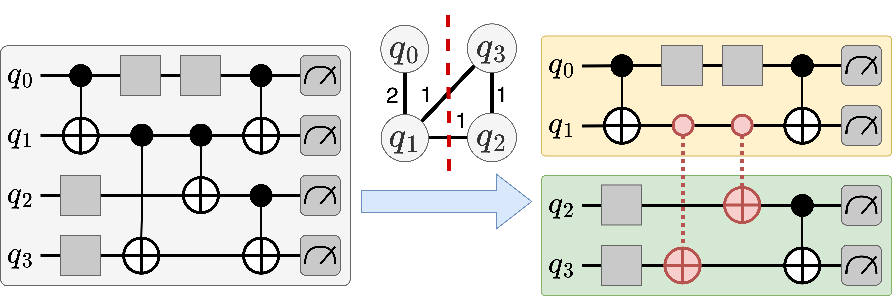
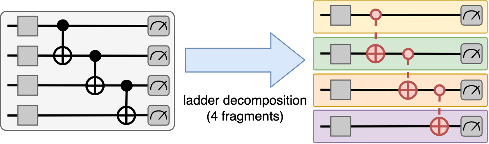

# Cut Passes

This is a summary of VQC's cut passes. A cut pass is used to cleverly virtualize binary gates in a given quantum circuit.

## Implementing a Cut Pass

Every cut pass inherits the base-class `vqc.cut.CutPass`, which itself inherits `qiskit.transpiler.TransformationPass`. Therefore, each pass implements the method `run()`:

```python
class SomeCutPass(CutPass):
    def run(dag: DAGCircuit) -> DAGCircuit:
        # ...
```

Cut passes generally use the two following functions to virtualize gates: 

1. `vqc.converters.dag_to_connectiviy_graph(dag: DAGCircuit) -> networkx.Graph` 

    Converts a `DAGCircuit` to a **qubit connectivity graph**. A qubit connectiviy graph is a `networkx.Graph`, where the vertices are the qubits of the dag, and the edges are the connections between qubits. Each edge has a `weight`, representing the number of gates between the qubits.

2. `vqc.cut.cut_qubit_connection(dag: DAGCircuit, qubit1, Qubit, qubit2: Qubit, vgates: Dict[str, Type[VirtualBinaryGate]])`

    Replaces every binary gate in the dag between qubit1 and qubit2 with the corresponding virtual gate. The virtual gates to use for this are given in `vgates`, where the name of the gate points to the type of the virtual gate to use.

    
## [`Bisection`](../vqc/cut/passes/bisection.py)



The `qvm.cut.Bisection` pass dissects a circuit into 2 equally sized fragments, while minimizing the number of virtual gates.
For this, it uses the Kernighan-Lin bisection algorithm on the connectivity graph of the circuit, which partitions the qubits of the circuits into two groups.

## [`LadderDecomposition`](../vqc/cut/passes/ladder.py)



The qvm.cut.LadderDecomposition pass can be used for circuits, where every binary gate is part of a gate-ladder. 
A gate-ladder is a sequence of binary gates spanning from the top qubit to the bottom qubit in a line, so that the qubits are only connected to their nearest neighbor. The pass dissects the circuit into num_partitions equally sized fragments.

Parameters:
- **num_partitions**: The number of fragments to create.